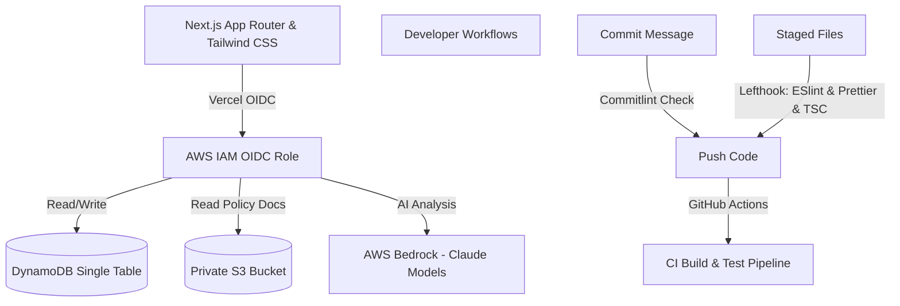

# ADR 0001: Record Architecture Decisions

- **Status**: Accepted
- **Date**: 2026-06-17
- **Author**: Principal Staff Engineer

---

## Context and Problem Statement

AuditTrail is a highly secure, multi-tenant B2B compliance hub. The system must support document storage, audit log storage, AI policy scanning, and multi-tenant billing. We need to define structural standards, high-level technology choices, and development workflows that enforce security, type safety, and deployment speed.

## Decision Drivers

- **Security & Compliance**: Tenant data isolation must be guaranteed. Access credentials should never be stored locally or hardcoded.
- **Developer Velocity**: Fast feedback loops for syntax checks, linting, formatting, and tests.
- **IaC Agility**: Declarative, fast, and type-safe infrastructure deployments.
- **Maintainability**: Unified code formatting and message standards across teams.

## Considered Options

### 1. Web Framework

- **Option A**: Next.js (App Router) - Server-side rendering (SSR), static site generation, React Server Components (RSC), and api routes.
- **Option B**: Single Page Application (React SPA) + Go/Python backend API.

_Decision_: Next.js App Router (Option A) due to first-class server/client split, SEO friendliness, fast rendering speed, and ease of deployment.

### 2. Infrastructure as Code (IaC) Framework

- **Option A**: AWS CDK (TypeScript).
- **Option B**: SST Ion (SST v3) - built on Pulumi, offering rapid local development and highly readable syntax.
- **Option C**: Terraform.

_Decision_: SST Ion (Option B). SST Ion leverages Pulumi for declarative TS definition, has incredibly fast deployment loops, and features native components like `sst.aws.Bucket` and `sst.aws.Dynamo` which abstracts boilerplate configuration.

### 3. Developer Tooling & Git Hooks

- **Option A**: Husky + lint-staged.
- **Option B**: Lefthook + Commitlint.

_Decision_: Lefthook + Commitlint (Option B). Lefthook is a Go-based, extremely fast, cross-platform hook runner. Unlike Husky, it doesn't require OS-specific shell wrappers (which often fail on Windows environments) and allows running checks in parallel.

---

## Detailed Tech Stack Choice

1. **Frontend**: Next.js v16 (App Router), React v19, Tailwind CSS.
2. **Infrastructure**: AWS Services defined declaratively via SST Ion (`sst.config.ts`).
3. **Database**: Amazon DynamoDB using single-table design for multi-tenant isolation.
4. **AI Policy Analysis**: Amazon Bedrock accessing Anthropic Claude foundation models.
5. **Static Analysis & Formatting**: ESLint (v9 flat config), Prettier, and TypeScript.
6. **Git Hooks**: Lefthook executing code checks (lint, format, typecheck) and Commitlint checking conventional commits on pre-commit/commit-msg.

## Consequences

- **Pros**:
  - Unified TypeScript stack across frontend and infrastructure.
  - Zero local long-lived credentials checked into Git.
  - Cross-platform developer environments (working flawlessly on both Windows and Unix-like OS).
  - Reduced boilerplate code with SST Ion components.
- **Cons**:
  - Requires developers to learn SST Ion resource structures.
  - High discipline needed for writing compliant conventional commits.
