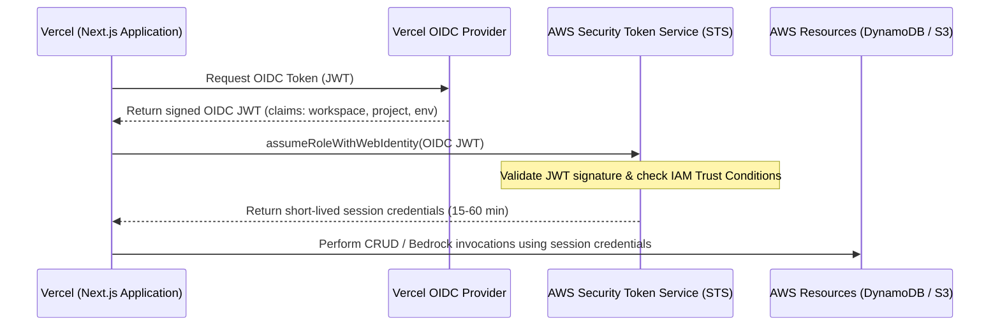

# ADR 0002: Database and Authentication Patterns

- **Status**: Accepted
- **Date**: 2026-06-17
- **Author**: Principal Staff Engineer

---

## Context and Problem Statement

AuditTrail is a B2B SaaS platform that tracks, stores, and validates compliance workflows for multiple corporate tenants. This requires:

1. An extremely scalable, secure, and isolated database pattern capable of multi-tenant query patterns.
2. A secure mechanism to grant deployment platforms (Vercel) and application workloads access to AWS resources (S3, Bedrock, DynamoDB) without introducing credentials-leakage vectors.

## Decision Drivers

- **Security & isolation**: Guarantee data segregation between tenants to prevent cross-tenant leakage.
- **Operational Overhead**: Minimize DB cluster maintenance, connection pooling, and infrastructure tuning.
- **Compliance Rules**: Standard security controls require rotating credentials, auditing API access, and minimizing long-lived secrets.

---

## Database Choice: Single-Table DynamoDB vs. Aurora DSQL

We evaluated two serverless storage systems:

1. **Amazon DynamoDB (Single-Table Design)**: A fully managed NoSQL database. Single-table design folds different entities (Tenants, Compliance Rules, Audits, Policies) into one table, using generic primary key indices (`pk` and `sk`) for querying.
2. **Amazon Aurora DSQL (Distributed SQL)**: A serverless relational database offering distributed transactions, SQL queries, and automatic scaling.

### Comparison Table

| Attribute            | DynamoDB (Single-Table Design)                                        | Aurora DSQL                                                           |
| :------------------- | :-------------------------------------------------------------------- | :-------------------------------------------------------------------- |
| **Data Model**       | Key-Value / Document                                                  | Relational (PostgreSQL compatible)                                    |
| **Scalability**      | Single-digit millisecond latency at any scale. No limits.             | Serverless relational scaling, but connection management is heavier.  |
| **Tenant Isolation** | Dynamic partition key prefix isolation (e.g., `TENANT#<id>`).         | Database, schema, or row-level security (RLS).                        |
| **Cost Profile**     | Pay-per-request (read/write capacity units). Extremely cheap at rest. | Hourly compute scaling units + storage capacity.                      |
| **Operational Ease** | No connection pooling problems, instant serverless scale.             | Connection pools require management (Prisma Accelerate or PgBouncer). |

### Decision

We choose **DynamoDB with Single-Table Design**.

- Single-table design allows AuditTrail to fetch a tenant profile, their active compliance rules, and recent audit trails in a single round-trip database query.
- It eliminates relational database connection limits, which is critical for serverless deployment on Vercel's edge/lambda routes.
- Access control can be fine-tuned at the item-level using AWS IAM conditions (e.g., restricting IAM role actions using leading keys corresponding to the tenant ID).

---

## Authentication: Vercel OIDC vs. Static AWS Access Keys

We evaluated how our Next.js frontend deployed on Vercel authenticates with AWS.

### 1. Static AWS Access Keys (Rejected)

- **Mechanism**: Generate an IAM user with programmatic credentials (`AWS_ACCESS_KEY_ID`, `AWS_SECRET_ACCESS_KEY`) and paste them as secret environment variables in Vercel.
- **Risks**:
  - Keys do not expire automatically. If a developer's machine or Vercel account is compromised, the keys remain active.
  - Secret rotation requires manual updates or complex scripts, often leading to developer overhead or skipped rotations.
  - Higher risk of accidental commit into public repositories.

### 2. Vercel OpenID Connect (OIDC) Integration (Selected)

- **Mechanism**: Define Vercel as a trusted OIDC Federated identity provider in AWS. When Next.js needs to access AWS resources:
  1. Next.js requests a short-lived JSON Web Token (JWT) from Vercel's OIDC provider.
  2. Next.js calls AWS Security Token Service (`sts:AssumeRoleWithWebIdentity`) passing the Vercel JWT.
  3. AWS validates the JWT signature, checks if the Vercel project name/workspace metadata matches the IAM role conditions, and returns short-lived (e.g., 15-minute) AWS session credentials.
- **Benefits**:
  - **No Long-Lived Secrets**: No static AWS access keys are generated or stored on Vercel.
  - **Strict Scoping**: The IAM Role is restricted via trust policies to a specific Vercel project and workspace.
  - **Auto-Rotation**: Session credentials expire automatically after minutes, dramatically reducing the threat window of compromised sessions.

---

## Consequences

- We eliminate programmatic IAM users entirely, aligning with SOC 2 Type II compliance recommendations.
- Workspaces and project paths must be clearly mapped. If the Vercel workspace name changes, the IAM trust policy condition must be updated.
- Applications will experience a minor cold-start latency when performing the initial `assumeRoleWithWebIdentity` handshake, which will be mitigated by caching the short-lived credentials for the duration of their validity.
