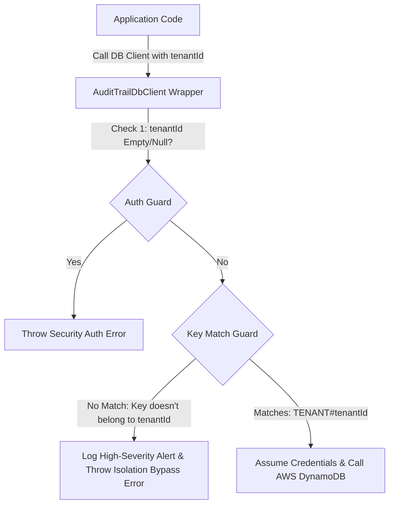

# ADR 0003: DynamoDB Single-Table Schema Design

- **Status**: Accepted
- **Date**: 2026-06-17
- **Author**: Senior Database Architect & Security Engineer

---

## Context and Problem Statement

AuditTrail requires a data storage architecture that supports multiple distinct B2B compliance frameworks, control statuses, and metadata for various corporate tenants. To guarantee security and high performance, we must define clear, single-table NoSQL partition and sort key strategies that cleanly isolate tenant domains.

## Decision Drivers

- **Tenant Isolation**: Complete isolation of data to prevent any possibility of cross-tenant exposure.
- **Access Patterns**: Efficient querying of frameworks and control items per tenant.
- **Performance**: Single-digit millisecond latency at scale.

---

## Proposed Schema Design

We will use a single DynamoDB table named `AuditTrailTable`. Both the Partition Key (`PK`) and the Sort Key (`SK`) are defined as `String` types.

### Composite Key Design

We map our core entities into the single table using the following key formats:

| Entity                 | Partition Key (`PK`)                          | Sort Key (`SK`)            | Attributes                                                                                    |
| :--------------------- | :-------------------------------------------- | :------------------------- | :-------------------------------------------------------------------------------------------- |
| **Tenant Config**      | `TENANT#<tenant_id>`                          | `METADATA`                 | `name`, `status` (ACTIVE/SUSPENDED), `createdAt`                                              |
| **Framework Status**   | `TENANT#<tenant_id>`                          | `FRAMEWORK#<framework_id>` | `score` (0-100), `status` (COMPLIANT/NON_COMPLIANT/IN_PROGRESS), `updatedAt`                  |
| **Compliance Control** | `TENANT#<tenant_id>#FRAMEWORK#<framework_id>` | `CONTROL#<control_id>`     | `title`, `description`, `status` (PASSED/FAILED/NOT_APPLICABLE), `evidenceS3Key`, `updatedAt` |

### Key Isolation & Query Logic

1. **Fetching Tenant Configuration**:
   - Query: `PK = TENANT#<tenant_id>`, `SK = METADATA`
2. **Fetching All Framework Statuses for a Tenant**:
   - Query: `PK = TENANT#<tenant_id>`, `SK` starts with `FRAMEWORK#`
3. **Fetching Framework Details + Score**:
   - Query: `PK = TENANT#<tenant_id>`, `SK = FRAMEWORK#<framework_id>`
4. **Fetching All Controls for a Specific Framework**:
   - Query: `PK = TENANT#<tenant_id>#FRAMEWORK#<framework_id>`, `SK` starts with `CONTROL#`
5. **Fetching a Single Control Status**:
   - Query: `PK = TENANT#<tenant_id>#FRAMEWORK#<framework_id>`, `SK = CONTROL#<control_id>`

---

## Security Controls (Isolation Guards)

To enforce isolation at the application layer, the client wrapper (`AuditTrailDbClient`) validates key consistency before sending operations to AWS:

- If `PK` is formatted as `TENANT#<tenant_id>`, the client verifies that `<tenant_id>` matches the session's active `tenantId` parameter.
- If `PK` is formatted as `TENANT#<tenant_id>#FRAMEWORK#<framework_id>`, the client extracts the tenant component and matches it against the active `tenantId` parameter.
- If any mismatch occurs, the request is immediately aborted, throwing a `SECURITY_ALERT` exception and logging a high-severity alert.

## Consequences

- **Pros**:
  - Predictable query performance (always single-digit millisecond latency).
  - Clear data layout mapping in code.
  - Zero-trust key validation checks block query manipulation attempts before contacting AWS.
- **Cons**:
  - Requires developers to maintain key-formatting prefix discipline.
  - Querying controls across multiple frameworks in a single query is not supported natively and requires separate table scans or secondary indexing (GSI), which will be designed under a separate ADR if needed.
