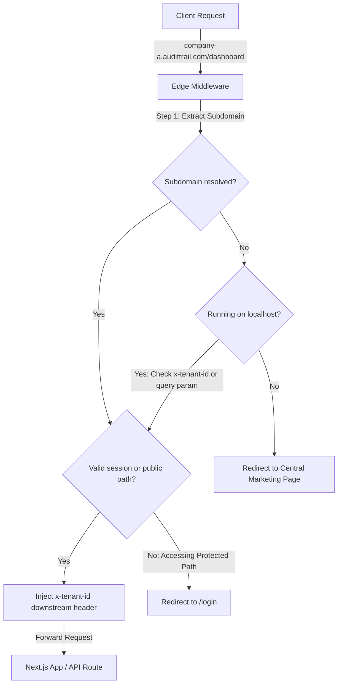

# ADR 0004: Observability and Request Interception Patterns

- **Status**: Accepted
- **Date**: 2026-06-17
- **Author**: Principal Infrastructure & Reliability Engineer

---

## Context and Problem Statement

AuditTrail is a multi-tenant B2B compliance hub. We must intercept requests at the network edge to isolate and route tenants safely. Furthermore, as an enterprise application, we need high-fidelity telemetry, structured logs, and latency metrics to profile database queries, S3 object access, and downstream AI model calls (AWS Bedrock).

## Decision Drivers

- **Security & Compliance**: Securely bind every incoming request to its target tenant.
- **Edge Affinity**: The routing must run in high-performance edge environments to minimize latency overhead.
- **Observability**: Logs must be structured in JSON for native parser compatibility (e.g. Datadog, AWS CloudWatch, Elasticsearch).
- **Zero Dependencies**: Minimize external packages in Vercel Edge Runtime to avoid compatibility issues.

---

## Proposed Design Decisions

### 1. Request Interception (Next.js Edge Middleware)

We implement a unified `middleware.ts` file running in the Next.js Edge Runtime.

- **Subdomain Extraction**: The middleware parses the incoming request URL host to isolate the tenant subdomain (e.g., `acme.audittrail.com` -> `acme`).
- **Local Host Emulation**: For local development (`localhost:3000`), we fallback to parsing custom query parameters (`?tenantId=...`) or headers (`x-tenant-id`).
- **Downstream Header Injection**: The resolved tenant identifier is injected as a secure `x-tenant-id` custom request header before passing control to the Next.js page or API router.
- **Path Protection**: Standard tenant paths (`/dashboard/*`, `/settings/*`, `/api/compliance/*`) are protected. If no valid tenant context exists, the middleware redirects users to the centralized login page (`/login`).



### 2. Structured Telemetry & Logging

We establish a lightweight JSON structured logger in `lib/logger.ts`.

- **Standard Signature**: Every log format outputs:
  ```json
  {
    "timestamp": "ISO-8601-String",
    "level": "INFO|WARN|ERROR|DEBUG",
    "message": "Log message description",
    "tenantId": "string",
    "correlationId": "string-uuid",
    "meta": "optional key-values"
  }
  ```
- **Correlation ID propagation**: Every request automatically receives a unique `correlationId` (generated via native Web Crypto `crypto.randomUUID()`). The logger passes this correlation ID across asynchronous execution contexts to trace a request lifecycle.

### 3. Performance Tracing

We implement a profiling utility wrapper `withTracing(spanName, fn, context)` in `lib/tracer.ts`.

- **High-Order Function**: Resolves latencies by wrapping execution logic in a `try/finally` block.
- **Native Performance APIs**: Uses `performance.now()` for precise millisecond duration metrics.
- **Span telemetry**: Emits standard `[TRACE-START]`, `[TRACE-END]`, and `[TRACE-ERROR]` structured logs containing performance durations. This captures:
  - Next.js Edge Router cold starts.
  - AWS DynamoDB and S3 execution speeds.
  - Latencies for calling Anthropic Claude via AWS Bedrock API.

---

## Consequences

- **Pros**:
  - Blazing fast edge routing and filtering.
  - Zero dependencies ensures the middleware compiles easily and has a minimal footprint.
  - Standardized JSON logs are ready to ingest by cloud observability agents.
- **Cons**:
  - Requires developers to explicitly propagate the `correlationId` across boundary helper methods.
