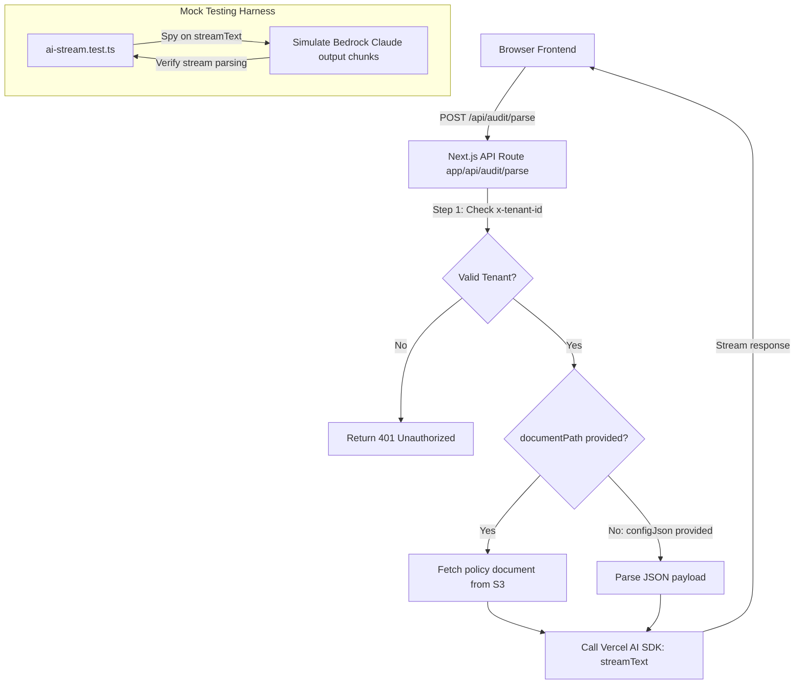

# ADR 0005: AI Compliance Parsing Pipeline

- **Status**: Accepted
- **Date**: 2026-06-17
- **Author**: AI Systems Architect & Backend Developer

---

## Context and Problem Statement

AuditTrail requires an automated compliance checker. It must read system configurations or policy documents, evaluate them against frameworks (such as SOC 2 and ISO 27001), highlight security vulnerability gaps, rate their severity, and supply remediation CLI commands or JSON patches. Users must receive these evaluations in real-time.

## Decision Drivers

- **Execution Latency**: Analyzing files can take 10-20 seconds. Standard HTTP request blocks will time out on serverless routes. We must stream response chunks instantly.
- **Prompt Fidelity**: The model must follow strict rules, avoid hallucinations, and structure its output with clear compliance details.
- **Local Dev & CI Uptime**: Avoid invoking expensive, rate-limited Bedrock APIs during local dev tests and CI automation.

---

## Proposed Decisions

### 1. Vercel AI SDK & Amazon Bedrock

We choose the **Vercel AI SDK (`ai`)** paired with the **Amazon Bedrock Provider (`@ai-sdk/amazon-bedrock`)** to access `anthropic.claude-3-5-sonnet-20240620`. Claude 3.5 Sonnet excels at parsing code configurations, evaluating rules, and generating structured outputs.

### 2. Real-time Streaming Response

- The route uses `streamText` from the Vercel AI SDK.
- It returns `result.toDataStreamResponse()`, which utilizes Server-Sent Events (SSE) to stream output tokens incrementally to the client. This prevents connection timeouts and enhances the user experience by displaying a live review feed.

### 3. Prompt Design (ISO 27001 / SOC 2 Auditor)

We implement a highly detailed System Prompt defining the assistant's context and capabilities:

- **Role**: Accredited ISO 27001 and SOC 2 Senior Lead Auditor.
- **Core Task**: Audit provided resources against security frameworks (SOC 2: Common Criteria; ISO 27001: Annex A).
- **Required Output Schema**: For every finding, output:
  - **Control ID**: Specific control clause violated.
  - **Vulnerability Gap**: Detailed description of the exposure.
  - **Severity Rating**: Low, Medium, High.
  - **Remediation**: Copy-pasteable CLI commands (AWS CLI, Terraform) or JSON patches to resolve the issue.

### 4. Mock Stream Testing Harness

We construct a Vitest test file `tests/ai-stream.test.ts` to mock the Bedrock streaming mechanism.

- **Logic**: We spy on `streamText` and configure it to return a mock `StreamTextResult` containing a readable stream of compliance JSON chunks.
- **Verification**: The test reads the stream using the SDK helpers to verify that:
  - The chunk contents parse correctly.
  - The API route logic executes correctly.
  - The streaming boundaries behave properly without crashing.

---

## Consequences

- **Pros**:
  - Eliminates serverless timeout issues.
  - Type-safe prompt and stream structures.
  - Clean test runs in CI/CD pipeline without AWS credential dependency.
- **Cons**:
  - Complex mock setup for streaming payloads.
