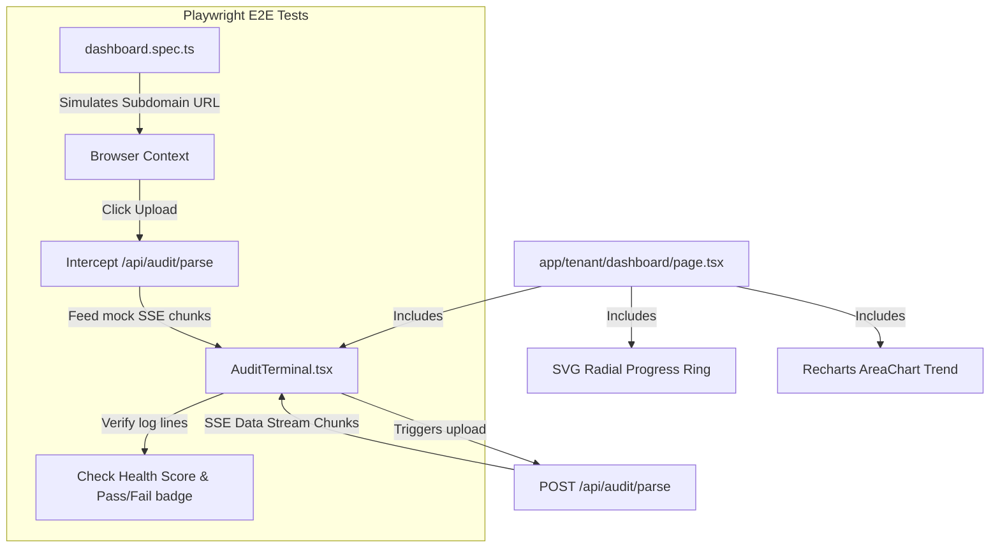

# ADR 0006: Frontend Dashboard and End-to-End Testing Patterns

- **Status**: Accepted
- **Date**: 2026-06-17
- **Author**: UX/UI Designer & Principal Frontend Engineer

---

## Context and Problem Statement

AuditTrail is a highly secure B2B compliance hub. Compliance managers need an intuitive dashboard rendering:

1. Overall compliance status (percentage health scores).
2. Posture metrics trends over time.
3. Interactive compliance checklist categorizing SOC 2, ISO 27001, and HIPAA controls.
4. An interactive terminal console showing real-time auditing events streamed from our AI parsing route.

Additionally, to guarantee user flows operate correctly under real browser workloads, we need an E2E testing framework mimicking file upload, stream interception, and DOM validation.

## Decision Drivers

- **Rich Aesthetics**: High-end B2B theme (subtle borders, zinc dark mode, high-contrast states).
- **Responsive Layout**: Works across multiple desktop sizes.
- **Precision Observer**: Playwright E2E tests checking elements loading, mock stream rendering, and DOM updates.

---

## Proposed Decisions

### 1. Charting & Visual Rings

- **Recharts Integration**: We choose Recharts for plotting compliance history trends because of its React declarative integration and SVG rendering flexibility.
- **Compliance Score Ring**: We use a custom SVG circular radial progress ring. This avoids bulky charting dependencies, allows smooth CSS transitions, and renders cleanly on both light/dark themes.

### 2. Audit Playback Terminal (AI Stream Console)

- **Interactive Console**: Built as a terminal console simulator component `AuditTerminal.tsx`.
- **Stream Parser**: Natively processes chunk tokens formatted in the Vercel AI SDK data protocol. It parses string payloads, appends logs to the local view state, and features auto-scroll anchors to stay focused on active streams.
- **Color Coding**: Evaluates log prefixes to format diagnostic information:
  - `[INFO]` -> Green/emerald tint.
  - `[WARN]` -> Amber/orange tint.
  - `[REMEDIATION]` -> Blue/cyan tint.

### 3. Playwright E2E Tests

We implement Playwright E2E tests in `tests/e2e/dashboard.spec.ts`.

- **Scope**:
  - Navigates to a tenant's subdomain (`http://company-a.localhost:3000/dashboard`).
  - Intercepts requests to `/api/audit/parse` and mocks a multi-part SSE chunk response.
  - Triggers the file upload event, waits for chunks to stream, and asserts that the `AuditTerminal` renders log lines dynamically.
  - Asserts that the overall health score circular indicator updates on completion, and a "Passed" or "Failed" compliance status badge gets rendered.

---

## Consequences

- **Pros**:
  - Fast, responsive interface.
  - Custom SVG ring minimizes bundle size and runs efficiently.
  - E2E browser tests guarantee the streaming UI does not freeze during high-throughput token feeds.
- **Cons**:
  - Requires mocking standard browser file uploads in Playwright.
